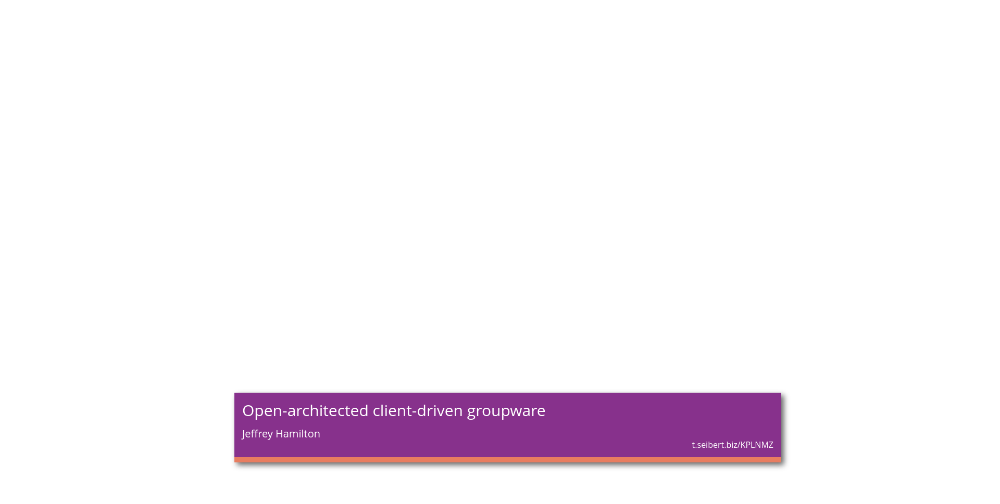
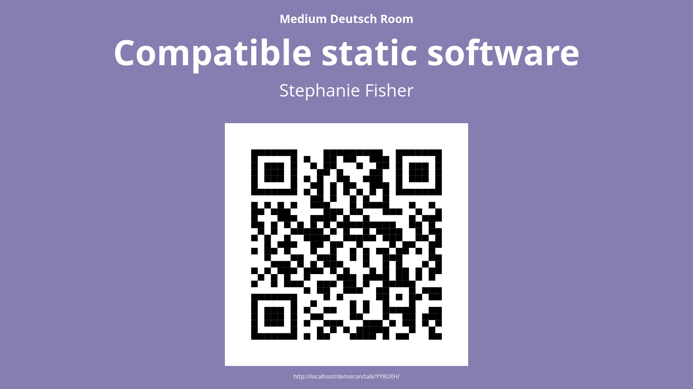
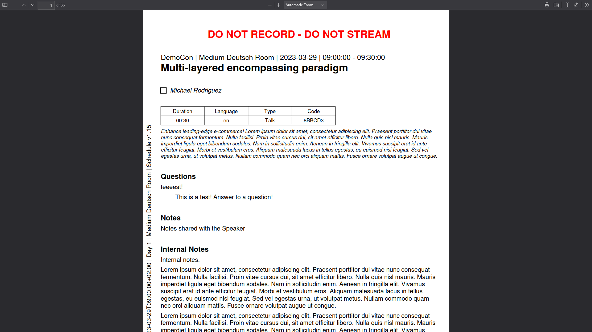

Pretalx: Broadcast Tools (and more)
===================================

.. image:: http://translate.pretalx.com/widget/pretalx-plugin-broadcast-tools/pretalx-plugin-broadcast-tools/svg-badge.svg
    :alt: Translation status
    :target: http://translate.pretalx.com/engage/pretalx-plugin-broadcast-tools/

This is a plugin for `pretalx`_.

This adds the following features to your pretalx instance:

* Lower Thirds ("Bauchbinden") for using with something like OBS
* a "room info" screen, if you want to show information about the
  currently running talk outside the room
* a pdf export containing information about a talk, so video helpers
  can have easy access to the needed information

Screenshots
-----------

The first two screenshots show the talk "Compatible static software" by
"Stephanie Fisher", which was generated by the `create_test_event` command.
The event color is `#EA652D`, a bright orange. The track color is `#857EB0`,
a light purple. The last screenshot shows "Multi-layered encompassing
paradigm" by "Michael Rodriguez".

         bottom quarter of the screen, taking about half the screen width.
         The box is mostly colored in the event color, with a small strip
         showing the track color at the bottom. Inside the box the talk
         title is shown in large text on top, the speaker name below that.
         On the bottom right of the box the configured info line is shown.

         in the track color. On top of the screen you see the room name
         in small font, below that the talk title in large letters. Below
         that there's the speaker name listed. On the remainder of the
         screen you see a large QR code linking to the talk detail page
         in the schedule. The URL is also shown in plain-text below the
         QR code.

         a large text "DO NOT RECORD - DO NOT STREAM", because the speaker
         selected "Do not record" in the CfP. Below that you find
         information like event- and room-name, date and time, talk title,
         checkboxes for each speaker, length of the talk, talk abstract.
         Also you can find answers to select questions and notes entered
         inside pretalx on the pdf export. In this screenshot most info
         has been extended by adding lots of "lorem ipsum" text.

Development setup
-----------------

1. Make sure that you have a working `pretalx development setup`_.

2. Clone this repository, eg to ``local/pretalx-plugin-lower-thirds``.

3. Activate the virtual environment you use for pretalx development.

4. Execute ``python -m pip install -e .`` within this directory to register
   this application with pretalx's plugin registry.

5. Execute ``make`` within this directory to compile translations.

6. Restart your local pretalx server. You can now use the plugin from
   this repository for your events by enabling it in the 'plugins' tab
   in the settings.

License
-------

Copyright 2021-2023 Franziska 'kunsi' Kunsmann

Released under the terms of the Apache License 2.0

.. _pretalx: https://github.com/pretalx/pretalx
.. _pretalx development setup: https://docs.pretalx.org/en/latest/developer/setup.html
.. _OBS Studio: https://obsproject.com/
