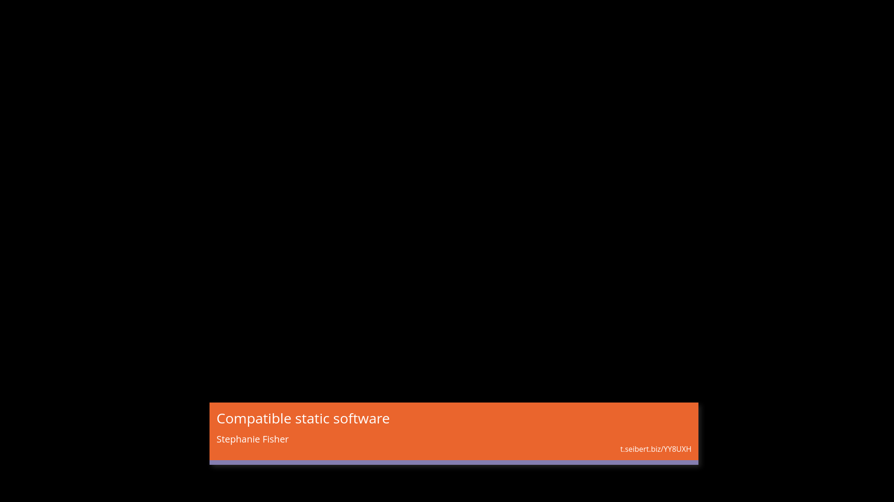

Lower Thirds
==========================

This is a plugin for `pretalx`_.

This plugin allows you to add configurable lower thirds ("Bauchbinden"
in German) to your pretalx instance. Most likely this will be used in
(for example) a Browser Source inside `OBS Studio`_.

The colours will be automatically determined from the event and track
colours set inside pretalx.

You can also add a configurable third line to the lower thirds, for
example to hint your audience to vote for the talks. To make this easier,
the plugin will automatically replace some placeholders inside the text,
so you can have individual text for all talks.

.. image:: img/orga_view.png
  :width: 400
  :alt: Screenshot of the orga view

Inside the orga view, you can also configure the text snippet that's
shown if there's no talk running currently.

Development setup
-----------------

1. Make sure that you have a working `pretalx development setup`_.

2. Clone this repository, eg to ``local/pretalx-plugin-lower-thirds``.

3. Activate the virtual environment you use for pretalx development.

4. Execute ``python setup.py develop`` within this directory to register
   this application with pretalx's plugin registry.

5. Execute ``make`` within this directory to compile translations.

6. Restart your local pretalx server. You can now use the plugin from
   this repository for your events by enabling it in the 'plugins' tab
   in the settings.

License
-------

Copyright 2021 Franziska 'kunsi' Kunsmann

Released under the terms of the Apache License 2.0

.. _pretalx: https://github.com/pretalx/pretalx
.. _pretalx development setup: https://docs.pretalx.org/en/latest/developer/setup.html
.. _OBS Studio: https://obsproject.com/
